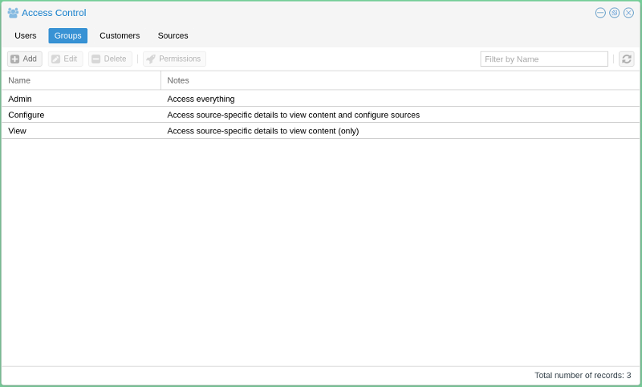

# Access Control

The access control sections deal with who can access what, along with the definition of what the "what" is and who the "who" are. This screen can be accessed by clicking on "Webcampak > Configuration > Access Control".

[](images/desktop.menu.accesscontrol.en.png "Click to see the full image.")

It will let you define users, groups customers and sources as well as their inter-relationships.

[](images/desktop.accesscontrol.en.png "Click to see the full image.")

## Customers

A customer is a simple mean of grouping users and providing such users with a customised Webcampak background colour and logo. Users are not required to be attached to a customer, but if they do, they can only be attached to one.

[](images/desktop.accesscontrol.customers.en.png "Click to see the full image.")

This screen takes the following parameters:

* __Name__: Customer Name, this field is only available for administrative purposes and is not visible to the end user.
* __BG Color__: Hexadecimal colour for Webcampak Desktop background. If left empty, the default Webcampak background colour will be displayed.
* __BG Logo__: A customer-specific logo (usually a PNG file) can be uploaded into the watermark directory of the wpresources account. If left empty the system will display Webcampak logo

## Groups

[](images/desktop.accesscontrol.groups.en.png "Click to see the full image.")

By default, Webcampak is pre-configured with three different groups:

* __Admin__: Can access all configuration screens on the system
* __Configure__: Can access configuration screens for authorised sources. General configuration settings are not available
* __View__: Can only view pictures and videos

Note that "root" user has access to every screens and configuration parameters.

By selecting a group and clicking on "Permissions", users can refine permissions enabled for this group. By default, the "Application" view is selected.

* __Available Applications__: List all applications that can be granted access to users members of this group
* __Selected Applications__: List all applications, users member of this group, have access to.

[](images/desktop.accesscontrol.groups.permissions.applications.en.png "Click to see the full image.")

The above screenshot captures the default configuration of the "Configure" group.

Clicking on the "Permissions" tab provides a mean to further refine access control, in particular in situations when a different level of permissions is necessary within one feature.

This is currently limited to sources configuration. It lets the user define which configuration settings can be accessed/modified by which type of users. 

[](images/desktop.accesscontrol.groups.permissions.permissions.en.png "Click to see the full image.")

For reference purposes, those settings are listed in the configuration model on GitHub: 

* [config-general.json](https://github.com/Webcampak/core/blob/develop/config/config-general.json)
* [config-source-ftpservers.json](https://github.com/Webcampak/core/blob/develop/config/config-source-ftpservers.json)
* [config-source-video.json](https://github.com/Webcampak/core/blob/develop/config/config-source-video.json)
* [config-source-videocustom.json](https://github.com/Webcampak/core/blob/develop/config/config-source-videocustom.json)
* [config-source-videopost.json](https://github.com/Webcampak/core/blob/develop/config/config-source-videopost.json)

The example (below), list 3 parameters, each with different permission level.
```json
{"name": "cfgsourceactive", "default": "no", "type": "yesno", "permission": "SOURCES_CONFIGURATION_SIMPLE", "description": "Activation of the source, possible values: yes or no"}
, {"name": "cfgsourcetype",  "default": "testpicture", "type": "alphanum", "permission": "SOURCES_CONFIGURATION_ADVANCED", "description": "Type of the source, possible values: gphoto, webcam, ipcam, rtsp, webfile, wpak"}
, {"name": "cfgsourcedebug", "default": "no", "type": "yesno", "permission": "SOURCES_CONFIGURATION_EXPERT", "description": "Turn on detailed debugging for gphoto2, possible values: yes or no"}
```

## Sources

Please refer to the [Sources section](en_Sources.md) of this user guide for details on how to add and configure sources.

## Users

The "Users" section is used add and configure Webcampak users.

[](images/desktop.accesscontrol.en.png "Click to see the full image.")

### Add User

Clicking on "Add" open the window used to add users.

[](images/desktop.accesscontrol.users.add.en.png "Click to see the full image.")

The system will then prompt to enter the following details:

* __Username__: Unique username on the system
* __Password__: User password on the system, note that only a hash of the password is stored, it is, therefore, impossible to "know" the password after it has been changed by the user. 
* __Active__: Is the user authorised to connect Webcampak user interface. 
* __Change Password next Logon__: Prompt the user to update his/her password at next login.
* __Customer__: Customer attached to this user
* __Group__: Permission group of the user, defines the permission level
* __Fristname, Lastname__: Firstname and Lastname of the user
* __E-mail__: User's email, it is key to use a real email since the system will be sending emails (lost password, reports, etc...) depending on user privileges. 
 
### Sources

Source access is managed on a per user basis, clicking on "Sources" allows specifying which sources can be accessed by the user.