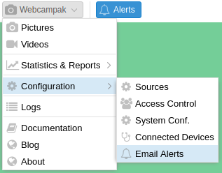
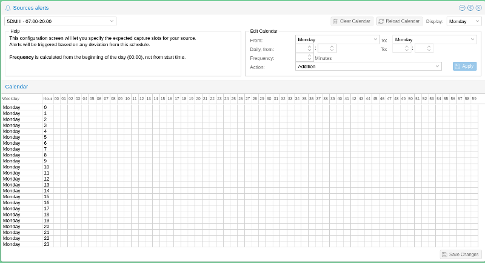
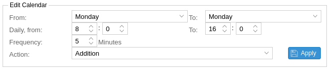
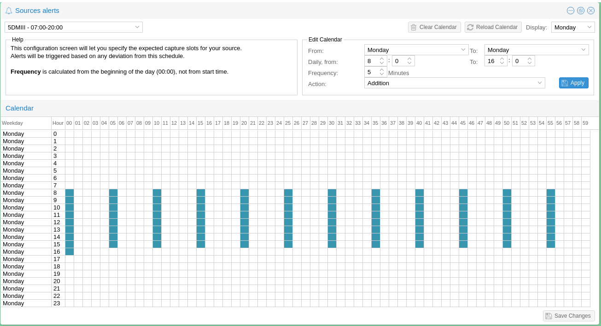
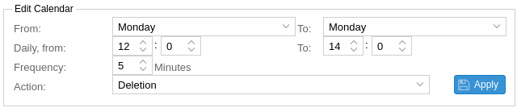
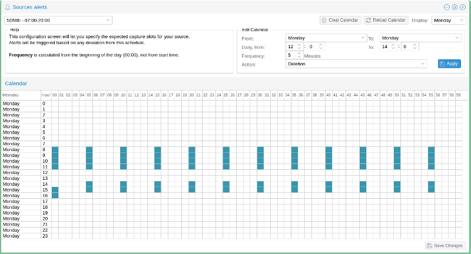

# Email Alerts

The email alerts configuration screen can be accessed by clicking on "Webcampak > Configuration > Email Alerts".

This featured is used to declare when pictures are expected to be captured for some of the sources. Webcampak can then trigger alerts based on deviation from this schedule. 

Each line represents an hour, each column a minute. By default, the system only displays one day (selected on the top-right of the window), but it can be configured to display the full week.

Clicking in the grid will select the corresponding date and time.

## Edit Calendar

Since it would be extremely tedious to select a large number of capture slots, the "Edit Calendar" section can be used to manage addition and deletion from this calendar.

In the example above, the system will add one picture every 5 minutes, on Mondays between 8:00 and 16:00.

Users can also "clear" some of the capture slots.

The above example will remove from the calendar, one picture every 5 minutes, on Mondays between 12:00 and 14:00.

Once users are satisfied with the result, they can save the alert calendar and start using it for their source.

