# Sources

Sources are at the core of Webcampak picture acquisition, processing and storage. Before starting to use webcampak, at least one source needs to be created.
 
## Add a source

To add a source, navigate to "Webcampak > Configuration > Access Control".

The access control window allows users to manager users, groups, customers and sources. 

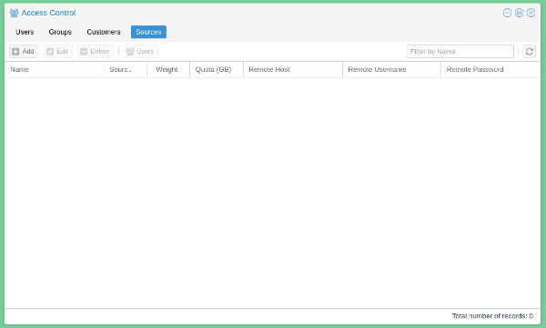

Users can add a new source by clicking on "Add".

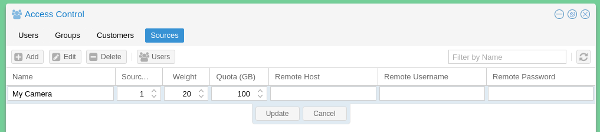

They will be requested to fill the following details:

* __Name__: The name of the source in the system
* __Source ID__: A numerical ID used internally to manage the source. This number must be unique but do not have to follow a sequence. For example, the FTP account for the source will be sourceX, with X being this number.
* __Weight__: Numerical value used for sorting purposes, the lowest number will be first. This number does not have to be unique, if multiple sources have the same weight, they will be sorted by name.
* __Quota (GB)__: Quota to be allocated for the source. Used for reporting purposes only, quotas are (on purpose) not enforced on webcampak.
* __Remote Host__: Unused, placeholder for a future feature.
* __Remote Username__: Unused, placeholder for a future feature.
* __Remote Password__: Unused, placeholder for a future feature.

Users can then be assigned to this source, by dragging them from the left side to the right side of the screen.

"__Alerts__", when turned on, will trigger emails sent by the system when there is an alert on this source and to receive daily statistics by email.

## Configuration

To configure a source, navigate to "Webcampak > Configuration > Sources".

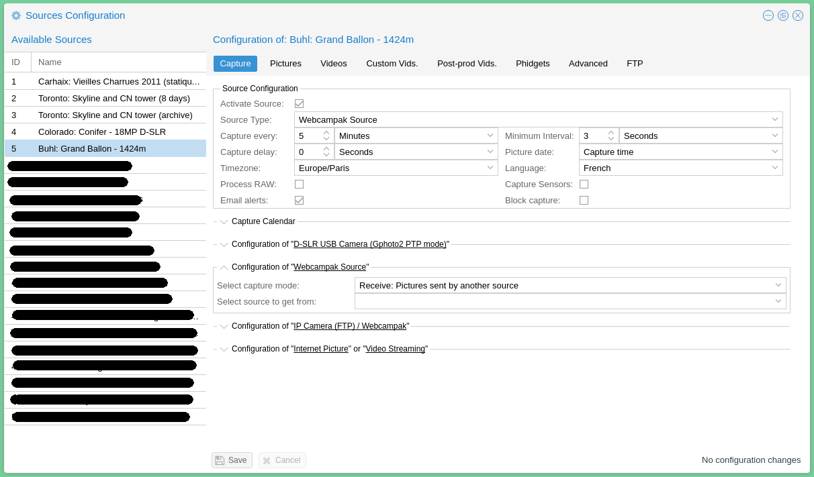

Users are presented with a list of available sources attached to their account. Webcampak does not auto-save configuration changes and will display the status of the configuration (modified, unmodified) in the bottom toolbar.

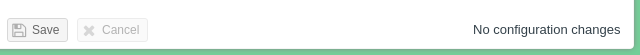

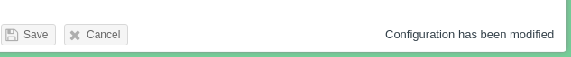

To prevent manipulation issues, users are required to either save or cancel changes before moving to another source.

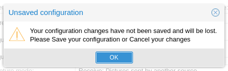

All changes to the configuration settings are [logged](../Use/en_Logs.md) by webcampak (who modified what, when), those logs are available in a dedicated section of the interface. All webcampak actions are logged, we strongly encourage users to consult those logs while the system is configured to learn more about all specificities of the capture process. Various metrics are also captured and those logs will contains details such as individual actions processing time, picture date, picture size, entire processing time, etc...

### Capture 

This tab is used to configure all settings directly related to picture acquisition.

#### Source Configuration 

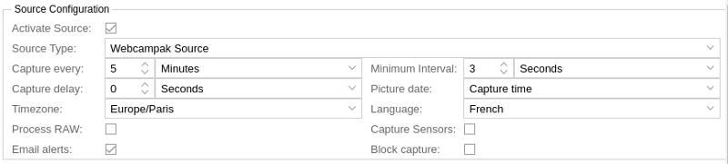

The following configuration settings are available in this section:

* __Activate Source__: Activate the source or not, if inactive, no action will be taken (no pictures, no videos).
* __Source Type__: Type of picture acquisition mechanism to be processed by the source.
* __Capture Every__: Interval at which the source will try to capture a picture.
* __Minimum Interval__: Minimum interval between two pictures. This acts more as a safeguard to avoid overloading the system by misconfiguration. Ideally, this number should be set to the longer capture time during the source operation window.
* __Capture Delay__: Delay before initiating capture. This is useful for chained sources to avoid processing delays.
* __Picture Date__: Select if date attached to the picture should be the script start time, or the actual picture acquisition time.
* __Timezone__: Timezone of the source
* __Language__: Language to be used by the source
* __Process RAW__: Enable RAW pictures acquisition & processing
* __Capture Sensors__: Enable Phidgets sensors acquisition just after picture processing
* __Email alerts__: Enable email alerts for the source
* __Block capture__: Block capture, disable the capture process while leaving the source active

#### Capture Calendar

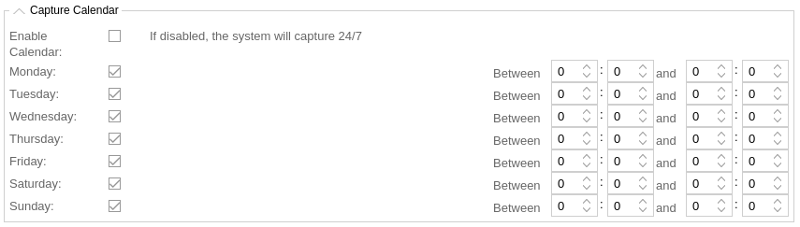

The following configuration settings are available in this section:

* __Enable Calendar__: If disable, the system will capture 24/7, if enabled it will capture at days selected below.
* __Monday - Sunday__: Enable capture this particular day, between those hours (24h format)

#### Configuration of D-SLR USB Camera (Gphoto2 PTP mode)

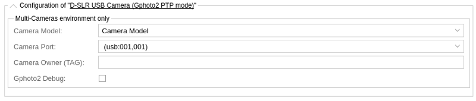

Those settings are only used when multiple D-SLR cameras are physically connected to the same webcampak.

The following configuration settings are available in this section:

* __Camera Model__: Camera Model
* __Camera Port__: USB port of the camera, the system will auto detect available formats
* __Camera Owner (TAG)__: User-defined TAG to assigned to the camera and used to verify which camera is which in case 2 identical models are connected
* __Gphoto2 Debug__: Run gphoto2 in debug mode, giving much more verbose output. Do not use this in production

#### Configuration of Webcampak Source

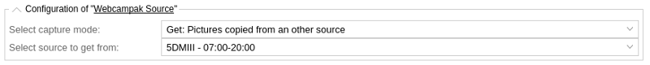

Those settings are used when pictures are coming from another webcampak source (chained sources).
 
The following configuration settings are available in this section:

* __Select capture mode__: Two mode are available "Get" or "Receive". If "Get", the source will actually try to capture the latest picture from the other source, this mode can only be used for local sources. If "Receive", the source will process pictures uploaded to its /tmp/ directory, this mode is usually used when remote webcampak are sending their pictures.
* __Select source to get from__: Source to get the picture from if "Get" is selected in "Select capture mode".
 
#### Configuration of IP Camera (FTP) / Webcampak

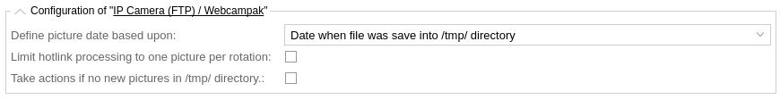

Those settings are used to process pictures uploaded to the /tmp/ directory, whether those are coming from IP Cameras or remote Webcampak.
 
The following configuration settings are available in this section:

* __Define picture date based upon__: Various methods are available to identify the picture's date. Additional parsers can be added to process more source types.
* __Limit hotlink processing to one picture per rotation__: This setting prevent multiple hotlinks to be created is multiple pictures are processed in batch. In this case only the hotlinks corresponding to the first picture are generated.
* __Take actions if no new pictures in /tmp/ directory__: Trigger alerts if no new pictures are available in /tmp/ directory.

#### Configuration of Internet Picture or Video Streaming

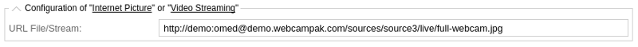

Those settings are used to process pictures by acquiring a remote image of video stream. 

* __URL File/Stream__: URL of the remote resource.

### Pictures

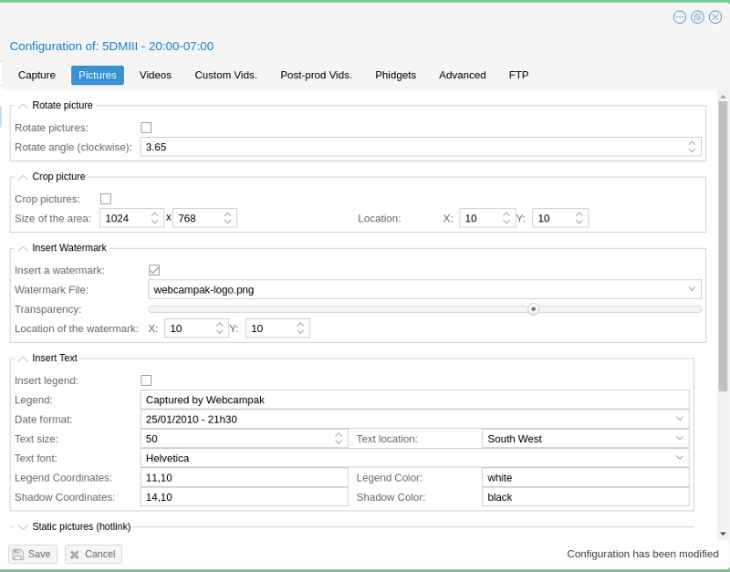

This section of the configuration allows you to define manipulations to be applied to pictures right after their capture.

Those settings are exectued in sequence in the order available in the configuration screen (picutre is first rotated, then rotated picture is cropped, etc ...).

#### Rotate picture

This option can be used to rotate the picture, clockwise, by a specific angle. Note that this feature is compute intensive and will impact duration of the capture process.

It should preferably be used on webcampak cloud or on webcampak devices with low capture rate.

#### Crop picture

This option can be used to crop the picture to a specific area, this is especially useful if you want to focus on a specific portion of a picture. The system asks you to detail the size of the area (in pixels) and it's start location (in pixels) from the top-left corner of the source picture.

#### Insert Watermark

This option can be used to insert a watermark into the picture. A watermark can simply be a logo, or be a more complex decoration around a picture (such as a specific box for the date, an improved legend, etc...).

Watermak files are pulled from two locations:

 * The global webcampak /resources/watermark/ directory, shared between all sources. This directory is accessible via FTP through the "wpresources" account (see general configuration).
 * The local source's /resources/watermark/ directory. This directory is accessible via FTP through the source's FTP account (see FTP tab).

Transparency (in %) with 0 being fully transparent and 100 being not transparent, can be defined as well as watermark's location from the top-left corner of the picture.

#### Insert Text

This option can be used to insert some text (single line) into the picture, usually a legend. If a date format is specified, it will be appended at the end of the legend's text, following the selected format.

The text can be added to various areas of the picture (Text location), the user can then define coordinates as an offset (in pixels) from this location (X,Y). 
For example selecting:
 
 * __Text location__: "South West" 
 * __Legend Coordinates__: 11,10

Will place the bottom left corner of the text area, to start 11 pixels on the X axis and 10 pixels on the Y axis from the bottom left corner of the picture.

Adding a shadow to the legend often makes the text more readable, the shadow is actually the same text, written behind the main text but with a different color and a slight pixel offset.

Note: If more complex static code needs to be added, this can be done through the watermark feature.

#### Static pictures 

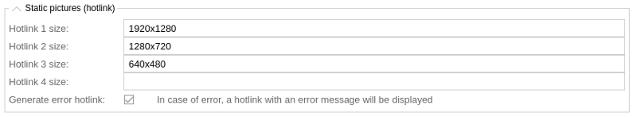

This option can be used to create "hotlinkable" pictures, those constantly keep the same filename and are automatically replaced as new pictures are being captured.

Webcampak can be configured to create 4 of those, which should give enough flexibility to for most use case (thumbnail link, full size, etc...).

Users can also chose to "Generate error hotlink", which, in case of failed capture, will replace the previous picture with an error message embedded in the picture.

#### Archives

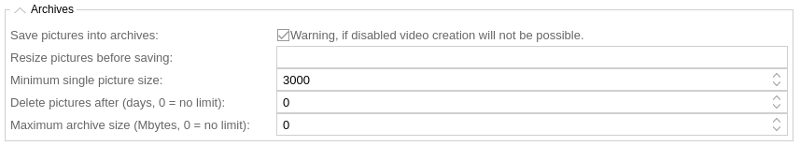

This section of the configuration contains various settings related to image size and clean-up:

 * __Save pictures into archives__: If unselected, the picture will be deleted at the end of processing. This prevents any videos from being created, and might only be useful on very specific situations where this sources is only used as a temporary processing step. In most situations this should be selected. 
 * __Resize pictures before saving__: Resize pictures to a specific format, using XxY format (in pixels), for example: 1024x768
 * __Minimum single picture size__: Minimum size, in bytes, of the picture. If below the system will consider the capture failed.
 * __Delete pictures after__: Automatically delete older directories after X days. Note that it delete a full day at once, not considering hours.
 * __Maximum archive size__: Maximum size of the entire pictures, in MB. If over, will delete a full day of pictures at each rotation, starting with the oldest day. 

#### Send pictures via FTP

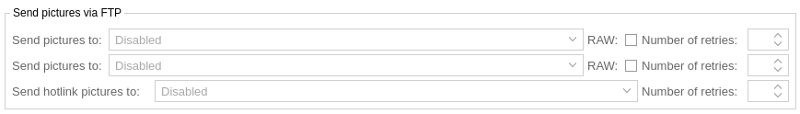

This option is used to specify FTP servers to send pictures to. Those servers are defined in the FTP tab.

Unless the option is selected, RAW files are not being sent to remote servers. Users can also specify the number of retries, in case of transmission failure. On top of sending the FTP command to send the picture. Webcampak also compares exact file size (bytes) at the end of the transfer, if files are different, it will consider that transfer failed.

#### Copy pictures internally

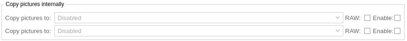

This option is used to copy pictures to another source within the webcampak. 

### Videos

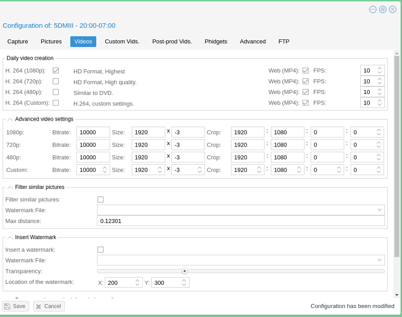

This section is used to configure videos generated daily (processing starts by default at 1am) by the system. 4 video definitions (1080p, 720p, 480p, custom) are supported by default, and 2 video formats (H.264 and MP4).

Similar to the "Pictures" section, picture manipulation settings are applied in sequence, following the configuration screen order.

#### Daily video creation

In this section, users can select video definition and formats, and frames per seconds (FPS).

Please note that the MP4 file is generated by converted the H.264 file, so MP4 files alone cannot be created, the corresponding H.264 option must be selected.

#### Advanced video settings

This section offer default configuration for most settings of 1080p, 720p, 480p definitions. Since in a vast majority of situations, source pictures are converted from 4:3 aspect ratio, only the last parameter (Y axis) of the crop is customizable (this is on purpose).

For example, for 1080p, settings are:

 * __Bitrate__: 10000
 * __Size__: 1920x-3
 * __Crop__: 1920:1080:0:0

The system will take the initial pidcture definition (for example 5616x3744 for a Canon 5D MII) it will resize its width to 1920 while maintaining the aspect ratio (-3 parameter). The resulting picture will have a definition of 1920x1280, it will then crop this picture for the video (Width:Height:X:Y), and since we already have the correct width the only parameter we want to customize is the Y offset. In our example:

 * 1920:1080:0:0 - means we cut the bottom 200 pixels of the picture
 * 1920:1080:0:100 - means we cut 100 pixels at the top and the bottom of the picture
 * 1920:1080:0:200 - means we cut the top 200 pixels of the picture

The custom parameter lets you personalize all settings. May you have sufficient compute power and memory resources, the system could generat 4K or 8K videos.

#### Filter similar pictures

This system lets you compare the (difference)[https://www.pureftpd.org/project/libpuzzle] between two pictures using (puzzle-diff)[https://linux.die.net/man/8/puzzle-diff]. This difference is represented as a "distance", you will probably have to run a couple of sample videos to identify the best threshold for your video.
 
For greater accuracy, a watermark can be defined, this watermak is applied by webcampak on each picture before calculating the difference. For example on a construction site, you might want to add a black watermark covering everything which does not deal with the building you are capturing. This way, the difference will only be calculated if something changed on the building itself (not capturing clouds movements for example).

The difference is a calculated between two consecutive pictures. For example PIC-1 is compared with PIC-2, if PIC-2 in over the threshold, it's not selected and PIC-1 is compared with PIC-3, then PIC-3 is compared with PIC-4, PIC-4 is compared with PIC-5, and so on.

Please note that this can slightly increase video creation runtime depending of the number of calculations to be executed.

#### Insert Watermark

Please refer to the Watermark section of the pictures tab.

#### Pre-processing manipulations (Advanced)

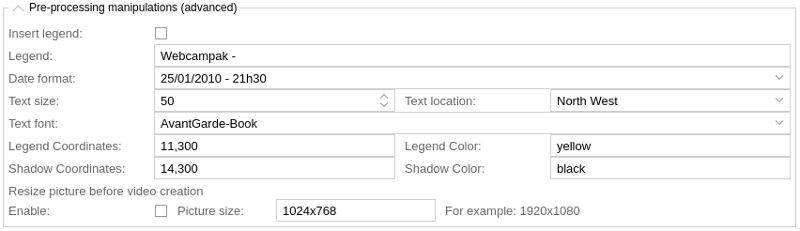

This sections lets you add a legend to your video (please refer to the text section of the picture tab).
 
It can also be used to resize pictures before video creation (this might have a positive impact on video creation time). Original pictures are not impacted by this setting.

#### Add an audio file

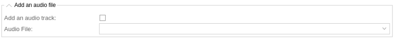

Webcampak let you add an audio track to your videos.

To add an audio track, login into global FTP account (wpresources) and copy MP3 files to /audio/ directory. This directory is shared between all sources.

MP3 filenames must only contain regular characters without blank space.

Add an audio track: select this option to add an audio track.

Audio file: select the file to be inserted.

Webcampak is compliant with playlist upon some conditions. Create a "playlist.m3u" file, this file must contain a list of MP3 files (one file per line)

Example of a "playlist.m3u" file

01-Yellow.submarine.mp3
02-Beat.it.mp3
Upload all files (M3U and corresponding MP3) via FTP to /audio/ directory.

During creation of the video, Webcampak will create a playlist.mp3 file, you can use this file for other videos and even rename it for later use.

#### Send videos via FTP

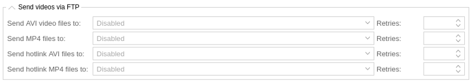

Videos can be uploaded to remote FTP servers defined in the FTP tab.

### Custom Vids

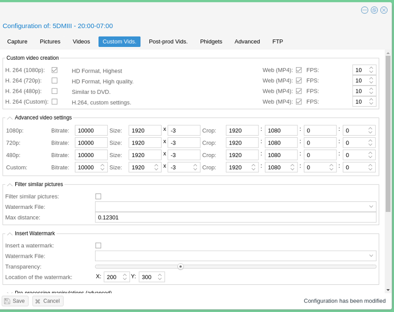

Most settings in this tab are identical to those available in the "Video" tab, we will only focus on custom settings.

#### Create a custom video

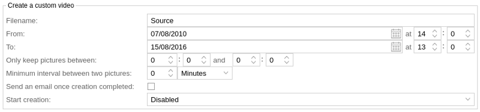

This section let you configure settings directly related to video creation (which could take hours if creation span multiple months).

Be careful with disk usage, Webcampak will copy all pictures to a temporary directory to apply modifications, as a result you will need free disk space corresponding to at least 2x the selected interval.

Following settings are available:

* __Filename (no spaces)__: Choose the name for your video file, if an identical name already exists Webcampak will automatically append a random 4 digit number at the end of the filename.
* __From__: Select start date and hour.
* __To__: Select end date and hour.
* __Keep pictures between__: only use pictures between a specific timeframe (i.e. between 8:00am and 7:00pm) to create video.
* __Minimum time between two pictures__: when preparing your video, Webcampak will check time between two captures, if lower than this value, the picture will be discarded.
* __Send an email once creation completed__: select this option to receive an email once video creation is completed.
* __Start video creation__: you can choose to start video creation as soon as possible or between 4h00 and 5h00 in the morning.

### Post-prod Vids.

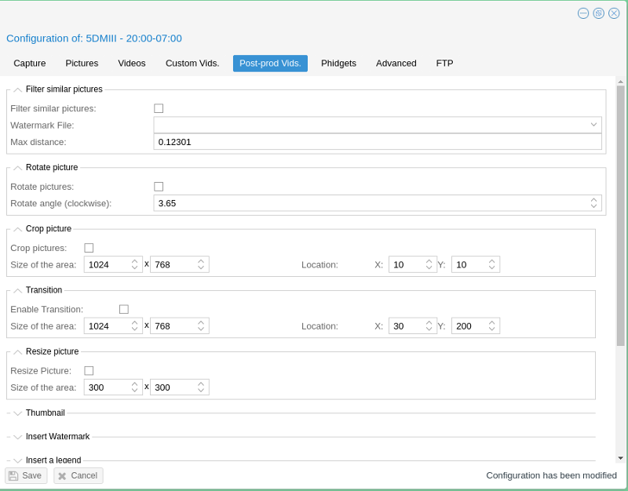

This section of the configuration allows users to batch process a large number of pictures.

Similar to the "Pictures" section, picture manipulation settings are applied in sequence, following the configuration screen order.

It was created for two main purposes:

* Reduce picture size: cropping/resizing pictures in batch reduces the overall size of pictures to be inserted into a video manipulation software.
* Advanced picture selection: copying pictures to a dedicated source allows users to delete sequences by still keeping original pictures.

This section has a lot of similarities with "Videos" and "Custom Videos" sections but with much more functionalities. Once processing is completed you can use "Custom Videos" to generate a video of the target source.

#### Filter similar pictures

Please refer to the "Filter similar pictures" section of the "Custom Vids." tab.

#### Rotate picture

Please refer to the "Rotate Picture" section of the "Pictures" tab.

#### Crop picture

Please refer to the "Crop Picture" section of the "Pictures" tab.

#### Transition

This section allows users to progressive focus to a specific portion of the picture. 

It works similarily to "Crop" but instead of applying the effect right away, it will calculate the number of frames between the first picture and last picture, and identify hwo to progressively modify the pictures to reach the selected coordinates.

#### Resize picture

This section allows users to resize pictures by specifying new dimensions in pixels.

#### Thumbnail

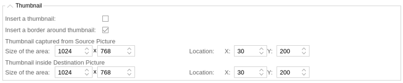

This section allows users to insert a thumbnail into a picture, it takes two main arguments:

* Size and location in a source, unmodified, picture (before any of the configured manipulations have been applied)
* Size and location in the destination, modified, picture (after configured manipulations have been applied)

By playing with various sizes, this allows users to play with focus area (zoom-in/out).

#### Insert Watermark

Please refer to the "Insert Watermak" section of the "Pictures" tab.

#### Insert a legend

Please refer to the "Insert a legend" section of the "Pictures" tab.

#### Initiate processing

This section let you configure settings directly related to starting batch processing (which could take hours if creation span multiple months).

Be careful with disk usage, Webcampak will copy all pictures to a temporary directory to apply modifications, as a result you will need free disk space corresponding to at least 2x the selected interval.

Following settings are available:

* __From__: Select start date and hour.
* __To__: Select end date and hour.
* __Keep pictures between__: only use pictures between a specific timeframe (i.e. between 8:00am and 7:00pm) to create video.
* __Minimum interval between two pictures__: when preparing your video, Webcampak will check time between two captures, if lower than this value, the picture will be discarded.
* __Move pictures to__: select the source you would like your pictures to be moved to.
* __Send an email once creation completed__: select this option to receive an email once video creation is completed.
* __Start creation__: you can choose to start video creation as soon as possible or between 4h00 and 5h00 in the morning.

### Phidgets

This section of the configuration allows users to configure interaction with Phidgets devices. Those are useful in multiple situations, and more specifically:

* Powercycle the camera after X number of failed captures
* Capture sensor values (temperature, humidity, etc...)

#### Relays

This section allows users to define when to powercycle the camera (cutting power supply during a couple of seconds) in case of capture issues. The following settings are available:
 
* __Powercycle the camera in case of failure__: Option to be selected to activate power-cycling.
* __Number of failure before camera powercycle__: How many failed capture before triggering the event.
* __Phidget camera port__: Port on the Phidgets board to which the relay is connected.
 
Note that power-cycling will only be triggered when the condition is first met (camera will only be powercycled once).
 
#### Graphs

Webcampak can generate RRDGraphs out of captured sensor values, enabling this option will make Webcampak refresh its sensor graphs every 5mn.

Phidgets graph get a static name, but changing sensors settings will trigger a new name to be created.

Graphs can also be sent to a remote FTP server defined in the "FTP" tab.

#### Sensors Configuration

Up to 4 different sensors can be configured in this section, by defining the following:

* __Type__: Type of sensor connected to the board (temperature, pressure, humidity, etc...)
* __Port__: Port on the Phidgets board to which the sensor is connected
* __Legend__: Legend to be displayed on the RRDGraph may such graph be generated
* __Color__: Color of the RRDGraph may such graph be generated

### Advanced

This sections allow users to configured more advanced parameters, and for now, dealing with email alerts.

#### Time Based Alerts

Time based alerts are triggered based on total elapsed time since last successful capture. This type of alert do not take into consideration any pre-configured schedule, it simply compare current time with last capture time.

At a pre-configured interval, the system will send a reminder about the failed status.

#### Schedule Based Alerts (missed captures)

Schedule based alerts are triggered based on calculating the number of missed captured since last successful capture. To use this part of the system, users will define in advance the expected weekly capture schedule.
 
Users can also configure a "grace" period, allowing for picture processing or data transfer time. During this grace period, calculated from last expected capture slot, the system will not take in consideration any possible failed capture.

For example, if the system expect a capture at 5:10 and the grace period is set to 5 mn, the system will only send an alert if the 5:10 picture is still missing at 5:15.

### FTP

This section of the configuration lets user configure local FTP credentials as well as list all remote FTP servers they would like to use.

#### Local FTP Account

Each Webcampak has its own internal FTP server, you can use those credentials to connect directly to the source, to download or delete content, or to configure an other source to send pictures to this particular source.

A password is generated automatically at source creation, you can change it at anytime.

#### Remote FTP Servers

Source-specific (not shared with other sources) remote FTP Servers can be configured in this screen, adding a remote FTP server takes the following parameters:

* __Name__: Local name used to reference the FTP server
* __Host__: Remote DNS name or IP Address
* __Username__: Username on the remote FTP server
* __Password__: Password on the remote FTP server
* __Directory__: Directory where the content should be sent to
* __Active__: Enable [FTP Active mode](http://slacksite.com/other/ftp.html)
* __Xfer Enable__: Enable Xfer mode (transfer job queueing)
* __Xfer Threads__: Number of parrallel transfer jobs supported by this server
