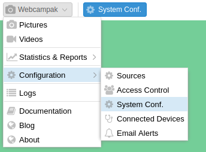
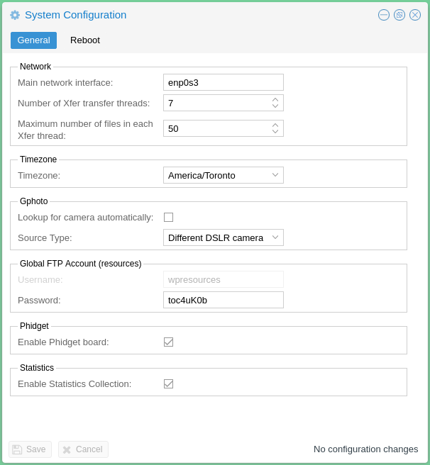

# System

The systeml configuration screen can be accessed by clicking on "Webcampak > Configuration > System Conf.".

It is used for general and non source-specific settings. 

## General

### Network

* __Main network interface__: A webcam can operate with multiple active network interface, this setting is used to specify which one should be used to collect statistics. This is typically the Internet-connected interface.
* __Number of Xfer transfer threads__: Define the number of [transfer queues](../Use/en_Xfer_Reports.md). This number depends of the number of CPU cores and RAM available on the Webcampak. A higher number, means more files can be transferred to various remote locations, but this also implies a greater amount resources being used.
* __Maximum number of files in each Xfer thread__: Each queue will be provisiong regularly with a specific number of transfer job. This number should be set depending of bandwidth availability and Webcampak hardware performance. 

### Timezone

Local timezone of the Webcampak server.

### Gphoto

Those 2 settings are only used when Webcampak is physically connected to multiple USB D-SLR cameras in order to understand how to differentiate those multiple cameras and identify their USB port.

### Global FTP Account (resources)

Webcampak is equipped with a FTP account giving access to Webcampak resources directory containing itmes such Webcampak database, logs, configuration files, queues, shared watermark, etc...

This directory does not provide access to sources.

### Phidgets

Enable or not phidgets board globally.

### Statistics

Enable or not statistics collection

## Reboot

This screen can also be used to trigger a Webcampak reboot.

