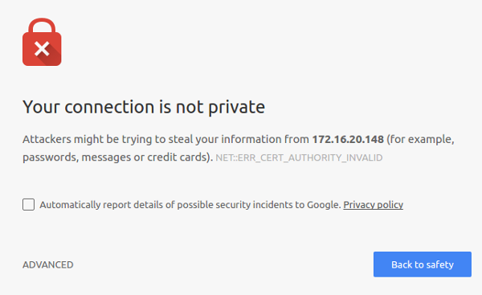
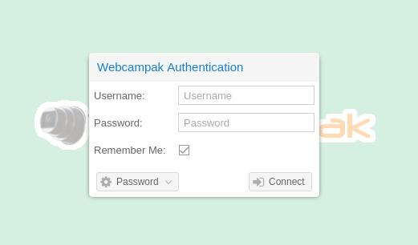
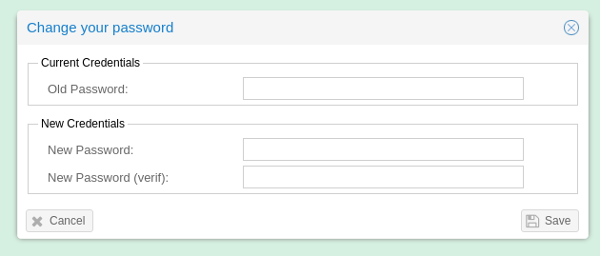
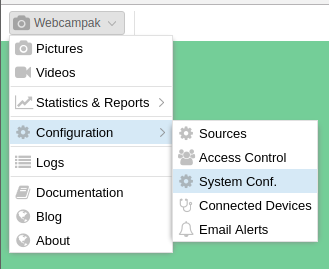
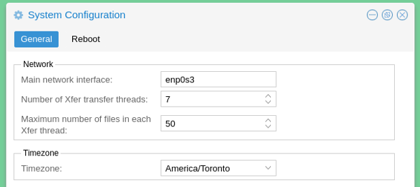

# Initial Setup

At the end of the installation script, go to the web interface of your webcampak.
 
## Self-signed certificate

During installation a [self-signed certificate](https://en.wikipedia.org/wiki/Self-signed_certificate) is created by the system. 

Although self-signed certificates should definitely be a concern and are not recommended for publicly accessible Webcampak instances, they represent the only option when domain names cannot be used (for example a local webcampak).

After initial setup you will be presented with a security warning from your browser. For now, accept it, but you are strongly encouraged to reconfigure the system to use a signed certificate issued by a public CA such as [letsencrypt](https://letsencrypt.org/).

You will then be presented with the default splash screen, select "Desktop" to begin installation.

## Authentication

You will be presented with the authentication screen, default credentials are:
* __Username__: root
* __Password__: webcampak

Since this will be the first connection, you will be offered to change your password.

Please note that this is not enforced and the same password can be entered (although not recommended).

## System configuration

As-is, a few configuration settings must be modified for the system to be useable.

Click on the top-left menu, and navigate to "System Conf."

You should then specify the following parameters:

* __Main Network Interface__: The network interface used by webcampak for most of its communications, you can get it using ifconfig
* __Timezone__: The timezone of the geographical location where this webcampak is installed. This can be different from the timezone used by its sources.

Webcampak initial setup is complete, you can now start adding sources.