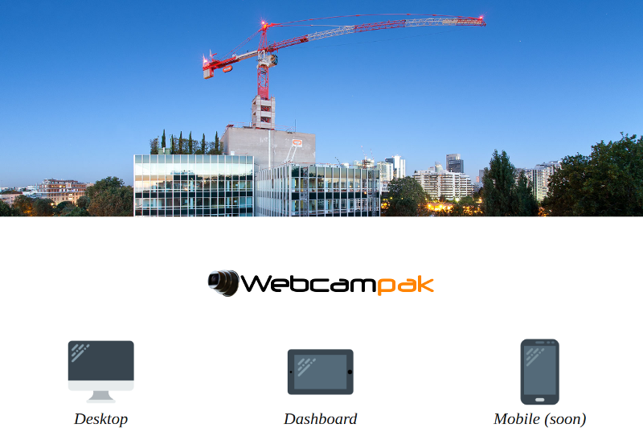
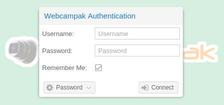
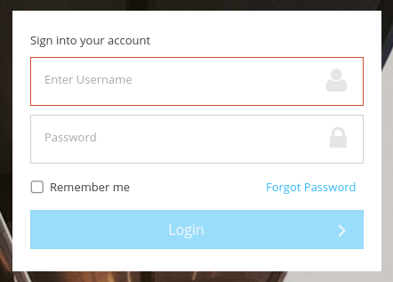
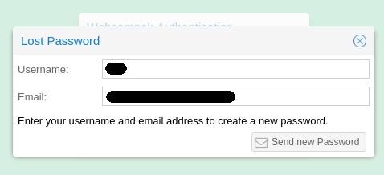
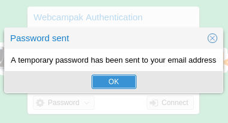
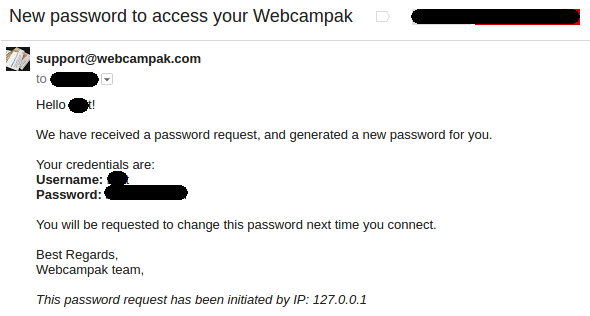
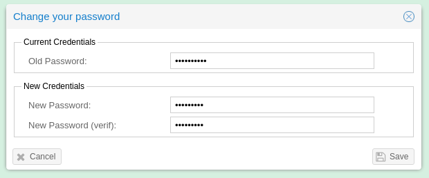
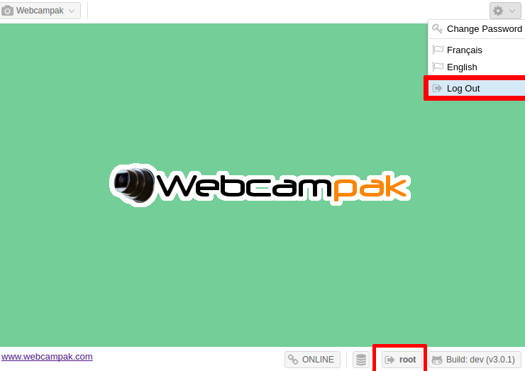

# Authentication

At first connection, users will be prompted to enter their password. After successful authentication, a session will be created for a pre-defined amount of time, prompting users to re-authenticate once the sessions has expired. 

Webcampak only supports connection via HTTPS. Depending of the system you are connecting to, you might either be redirected automatically to the HTTPS version or be prompted to do so.

## Splash Screen

The splash screen allows you to select between a fully featured Desktop application and a Dashboard application.

The Desktop application provide most features and allow both viewing content and performing advanced configuration. The Dashboard application is a simplier view into the Webcampak with a more modern user interface.

## Connection

The splash screen allows you to select between a fully featured Desktop application and a Dashboard application.

Both Desktop and Dashboard login screens are very similar in terms of features.

## Lost Password

In case of lost password, users can request a new one to be sent to their email address by specifying their username and email address. 

The system will first verify that username and email address to match before sending an email with a temporary password by email.

At next connection, the user will be prompted to update the password.

Once logged-in, user can:

* See their username displayed on the bottom right corner
* Log Out using the menu on the top right corner of the screen

