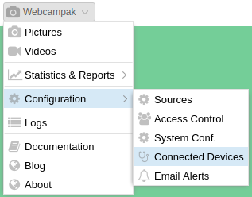
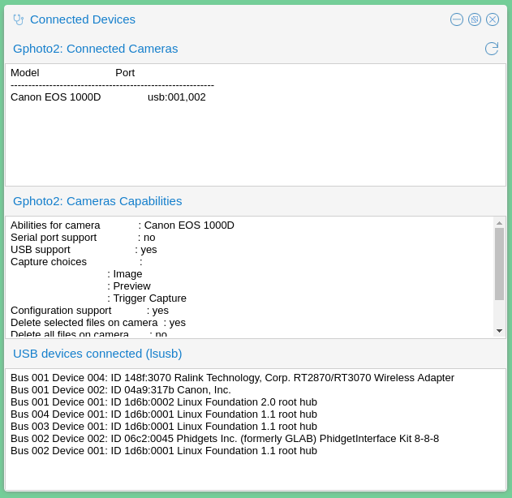

# Connected Devices

A screen listing connected USB devices can be accessed by clicking on "Webcampak > Configuration > Connected Devices"

[](images/desktop.menu.configuration.devices.en.png "Click to see the full image.")

## Overview

This simple feature runs 3 background commands to identify devices connected to Webcampak, a refresh button on the top-right corner let users manually trigger a refresh (for example after plugging a device).

[](images/desktop.devices.en.png "Click to see the full image.")

## Gphoto2: Connected camera

This section lists cameras detected by gPhoto2, the library used to communicate with the camera. If your camera is not listed there, Webcampak cannot trigger captures.

The following command is being executed in the background:
```
$ gphoto2 --auto-detect
Model                          Port                                            
----------------------------------------------------------
Canon EOS 1000D                USB:001,002
```

## Gphoto2: Cameras Capabilities

This section list camera features supported by gPhoto2. If a connected camera does not have any "Capture choices", it's likely that it is not supported for capture.

The following command is being executed in the background:
```
$ gphoto2 -abilities
Abilities for camera             : Canon EOS 1000D                             
Serial port support              : no
USB support                      : yes
Capture choices                  :
                                 : Image
                                 : Preview
                                 : Trigger Capture
Configuration support            : yes
Delete selected files on camera  : yes
Delete all files on camera       : no
File preview (thumbnail) support : yes
File upload support              : yes

```

## USB devices connected

This section list USB devices connected to the Webcampak. If a connected camera is not listed here, it is likely not powered-on. 

The following command is being executed in the background:
```
$ lsusb
Bus 001 Device 004: ID 148f:3070 Ralink Technology, Corp. RT2870/RT3070 Wireless Adapter
Bus 001 Device 002: ID 04a9:317b Canon, Inc. 
Bus 001 Device 001: ID 1d6b:0002 Linux Foundation 2.0 root hub
Bus 004 Device 001: ID 1d6b:0001 Linux Foundation 1.1 root hub
Bus 003 Device 001: ID 1d6b:0001 Linux Foundation 1.1 root hub
Bus 002 Device 002: ID 06c2:0045 Phidgets Inc. (formerly GLAB) PhidgetInterface Kit 8-8-8
Bus 002 Device 001: ID 1d6b:0001 Linux Foundation 1.1 root hub
```
