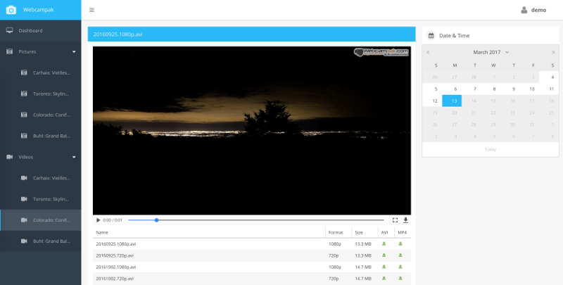

# Dashboard Interface

After authentication, the Webcampak dashboard interface is being displayed. Its main purpose is to provide a simplified view into Webcampak's operation.

## Home

The dashboard's landing page display details about current webcampak activities with details such as connected cameras, overall disk space, system uptime.

It also lists last pictures processed by all sources, along with expected next capture slot, configured captured frequency, and sources' disk usage.

By clicking on the username on the top-right corner user can change password or log-out.

## Pictures

The pictures view provides access to all pictures captured by the selected source.

Users can navigate within pictures, send some of those by email, view pictures details and access sensors.

## Videos

The videos view provides access to all videos generated by the system for the selected source.

## Config

The config view provides access to a limited list of settings, enabling the source, defining capture frequency and/or capture calendar.

