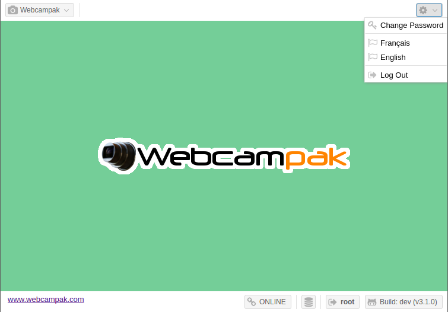

# Desktop Interface

After authentication, the Webcampak desktop interface is being displayed. This interface is broken down in 3 main sections:

* __Webcampak__ menu on the top left corner, giving access to all of Webcampak features
* __Settings__ menu on the top right corner, for settings of the desktop interface
* __Interface status__ on the bottom right corner

## Webcampak Menu

The Webcampak menu gives access to all Webcampak features and configuration screens. Those screens are detailed later in the documentation.

## Settings

The settings menu provides access to configuration of the desktop interface itself, such as changing the password, language or logging out of the system.

## Interface Status

Status details are provided on the bottom right corner of the screen.

### Connection

The first status displayed on the left side if the connection status, it indicates whether the desktop interface is able to communicate with its webcampak. This should be showing up "ONLINE" most of the time except in case of network issues or if the Webcampak is being rebooted.

Mousing over the status, will also display the latency in miliseconds. This latency mesure how much time it takes for the desktop interface to contact the Webcampak to obtain its connection status. The lower the better, but this number might be slightly high if you or your Webcampak are connected over high latency links (in particular satellite).

### Communication

The small database icon, second from the left, indicates the number of calls made to your Webcampak to retrieve or submit data. When communication happens, a number is displayed in parenthesis next to the database icon. This should only show up when an action is triggered and should clear pretty quickly.

### Username

The third icon from the left is the currently connected user. Clicking on the user will log you out of the system.

### Software Version

The fourth icon from the left display the current Webcampak version, clicking on the version will redirect to [Webcampak GitHub organization](https://github.com/Webcampak). Mousing-over the version will display exact version of all Webcampak components:

* __CORE__: Webcampak Core repository, contains mostly translations, installation assets, etc...
* __UI__: Webcampak User Interface (Desktop, Dashboard)
* __API__: Webcampak API, receives and interprets calls from the UI
* __CLI__: Webcampak CLI, drives all Webcampak background activities

#### Are you running the latest version ?

We don't necessarily recommend to be running the very latest dev version, but if you do wonder about what might be missing in the version you are currently running, you can read the version tag this way: v3.1.0-6-gb0a3277

* __v3.1.0__: Webcampak version
* __6__: Number of changes (commits) deployed on this Webcampak since this version was created
* __b0a3277__: The commit tag corresponding to the version currently deployed

If we look a bit closer at the UI commit tag, we can find the current deployed version in the [commit history of the develop branch](https://github.com/Webcampak/ui/commits/develop).

It basically tells us that there has been the following new changes (commits) since this Webcampak was last updated:

* Fixed a bug with configuring phidgets sensors
* Display exception when loading status
* Update Cfgwatermarkpositionx.js
* Update Cfgwatermarkpositiony.js

It is then your call to decide whether you want to manually update to the latest version or not.

