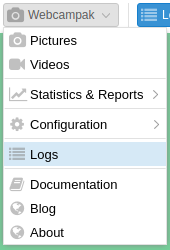
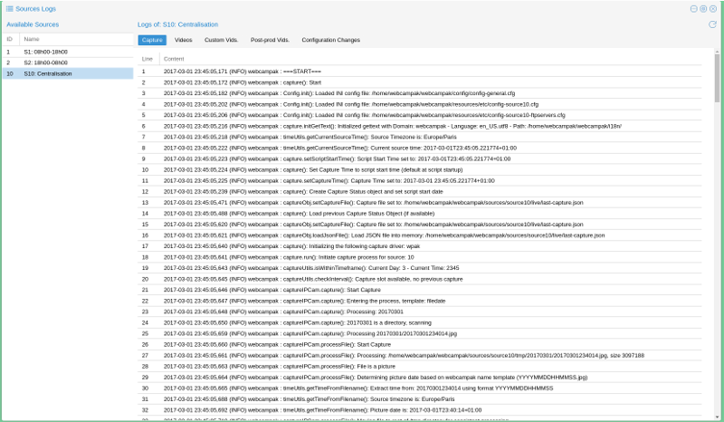
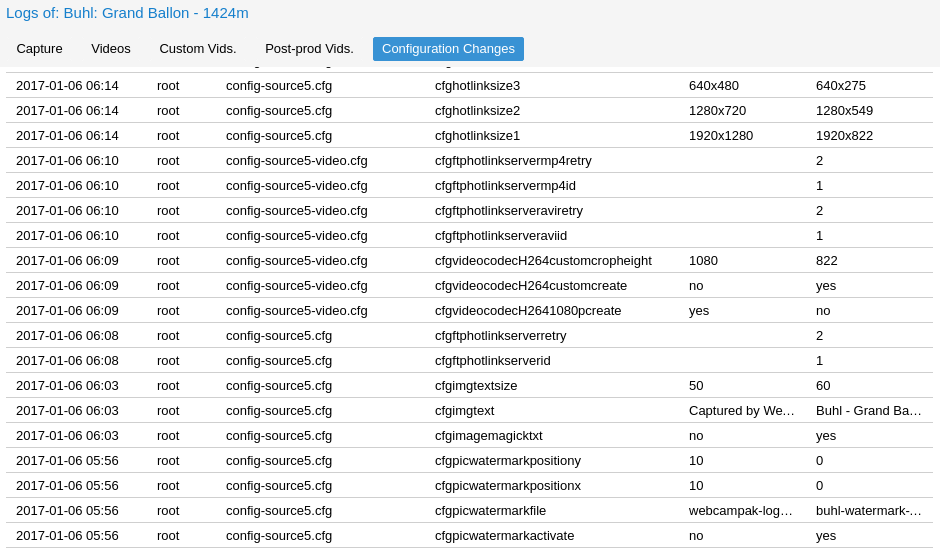

# Logs

Webcampak constantly records its background activities and store those in files available from the desktop interface. Those can be accessed by clicking on "Webcampak > Logs"

[](images/desktop.menu.logs.en.png "Click to see the full image.")

## Overview

This simple feature runs 3 background commands to identify devices connected to Webcampak, a refresh button on the top-right corner let users manually trigger a refresh (for example after plugging a device).

[](images/desktop.logs.capture.en.png "Click to see the full image.")

### Log Rotation

Webcampak record a very large portion of its background activities. 

Working on the assumption that logs are useful to debug an issue but less useful when there is no issue, we enabled log rotation, to prevent the local hard drive from being overloaded by unused logs.

The system will break down log files in 500 KB chunks and will only keep 10 of those files, which should give you about a week worth of logs for source capture.

## Insight into a Capture log

Logs files are the best way to understand activities being performed by the system and potentially understand what is causing issues. We always recommend our users, involved in Webcampak configuration, to understand what logs are and how to access & read them.

A [Sample log file](logs/capture.log) taken from one of our systems is available for reference, we'll progressively go through it.

```Logs
2017-03-01 16:30:13,290 (INFO) Webcampak : ===START===
```

We can break down a log line in the following section:

* __2017-03-01 16:30:13,290__: System date and time
* __(INFO)__: Log level, anything other than "INFO" should trigger further investigations
* __webcampak__: Our application
* __===START===__: Log message, here beginning of a capture session

Before triggering a capture, Webcampak first activity will be to get ready for this capture, load config parameters, setup the timezone, prepare the capture file. 

```Logs
2017-03-01 16:30:13,292 (INFO) Webcampak : capture(): Start
2017-03-01 16:30:13,386 (INFO) Webcampak : Config.init(): Loaded INI config file: /home/webcampak/webcampak/config/config-general.cfg
2017-03-01 16:30:13,532 (INFO) Webcampak : Config.init(): Loaded INI config file: /home/webcampak/webcampak/resources/etc/config-source1.cfg
2017-03-01 16:30:13,534 (INFO) Webcampak : Config.init(): Loaded INI config file: /home/webcampak/webcampak/resources/etc/config-source1-ftpservers.cfg
2017-03-01 16:30:13,564 (INFO) Webcampak : capture.initGetText(): Initialized gettext with Domain: Webcampak - Language: en_US.utf8 - Path: /home/webcampak/webcampak/i18n/
2017-03-01 16:30:13,594 (INFO) Webcampak : timeUtils.getCurrentSourceTime(): Source Timezone is: Europe/Paris
2017-03-01 16:30:13,626 (INFO) Webcampak : timeUtils.getCurrentSourceTime(): Current source time: 2017-03-01T16:30:13.597988+01:00
2017-03-01 16:30:13,627 (INFO) Webcampak : capture.setScriptStartTime(): Script Start Time set to: 2017-03-01T16:30:13.597988+01:00
2017-03-01 16:30:13,628 (INFO) Webcampak : capture(): Set Capture Time to script start time (default at script startup)
2017-03-01 16:30:13,629 (INFO) Webcampak : capture.setCaptureTime(): Capture Time set to: 2017-03-01 16:30:13.597988+01:00
2017-03-01 16:30:13,658 (INFO) Webcampak : capture(): Create Capture Status object and set script start date
2017-03-01 16:30:14,661 (INFO) Webcampak : captureObj.setCaptureFile(): Capture file set to: /home/webcampak/webcampak/sources/source1/live/last-capture.json
2017-03-01 16:30:14,783 (INFO) Webcampak : capture(): Load previous Capture Status Object (if available)
2017-03-01 16:30:15,401 (INFO) Webcampak : captureObj.setCaptureFile(): Capture file set to: /home/webcampak/webcampak/sources/source1/live/last-capture.json
2017-03-01 16:30:15,402 (INFO) Webcampak : captureObj.loadJsonFile(): Load JSON file into memory: /home/webcampak/webcampak/sources/source1/live/last-capture.json
2017-03-01 16:30:15,481 (INFO) Webcampak : capture(): Initializing the following capture driver: gphoto
```

Next, Webcampak will verify if it is allowed to capture (capture calendar, time since the last capture). If all is correct, it will initiate the actual capture process.

```Logs
2017-03-01 16:30:15,482 (INFO) Webcampak : capture.run(): Initiate capture process for source: 1
2017-03-01 16:30:15,495 (INFO) Webcampak : captureUtils.isWithinTimeframe(): Current Day: 3 - Current Time: 1630
2017-03-01 16:30:15,497 (INFO) Webcampak : captureUtils.isWithinTimeframe(): Capture allowed between: 800 and: 1800
2017-03-01 16:30:15,512 (INFO) Webcampak : captureObj.getLastCaptureTime(): Last capture time: 2017-03-01 16:20:17.075944+01:00
2017-03-01 16:30:15,513 (INFO) Webcampak : captureUtils.checkInterval(): Last capture 596522 ms ago
2017-03-01 16:30:15,530 (INFO) Webcampak : captureUtils.checkInterval(): Minimum capture interval: 3000 ms
2017-03-01 16:30:15,531 (INFO) Webcampak : captureUtils.checkInterval(): Capture slot available
2017-03-01 16:30:15,532 (INFO) Webcampak : captureGphoto.capture(): Initiating capture
```

Just before capturing the picture, it will record the time. by comparing the current time with the beginning of the capture process, we can see that it took Webcampak a bit more than 2 seconds to get there.

Then the system actually captures the picture, transfer the file locally and check its file size.

```Logs
2017-03-01 16:30:15,533 (INFO) Webcampak : timeUtils.getCurrentSourceTime(): Source Timezone is: Europe/Paris
2017-03-01 16:30:15,549 (INFO) Webcampak : timeUtils.getCurrentSourceTime(): Current source time: 2017-03-01T16:30:15.549352+01:00
2017-03-01 16:30:15,648 (INFO) Webcampak : captureGphoto.triggerCapture(): Gphoto: Start Capture
2017-03-01 16:30:21,576 (INFO) Webcampak : captureGphoto.triggerCapture() - OUTPUT 1: New file is in location /capt0000.jpg on the camera
Saving file as /home/webcampak/webcampak/sources/source1/tmp/20170301163013.jpg
Deleting file /capt0000.jpg on the camera

2017-03-01 16:30:21,578 (INFO) Webcampak : captureGphoto.triggerCapture() - OUTPUT 2:
2017-03-01 16:30:21,580 (INFO) Webcampak : captureUtils.verifyCapturedFile(): File: /home/webcampak/webcampak/sources/source1/tmp/20170301163013.jpg size is 3256854 bytes
2017-03-01 16:30:21,581 (INFO) Webcampak : captureUtils.verifyCapturedFile(): Check File: Successful
2017-03-01 16:30:21,582 (INFO) Webcampak : captureGphoto.capture(): Capture successful
```

It might be interesting to focus here on the actually time between the camera was requested to capture and the time the picture was actually stored on local disk.

```Logs
2017-03-01 16:30:15,648 (INFO) Webcampak : captureGphoto.triggerCapture(): Gphoto: Start Capture
2017-03-01 16:30:21,576 (INFO) Webcampak : captureGphoto.triggerCapture() - OUTPUT 1: New file is in location /capt0000.jpg on the camera
```

In this particular example, it took just short of 6 seconds. This number will vary a lot depending on exposure time, USB speed and file size.

Webcampak will then apply all the configured manipulation to the picture. You can notice that some of the manipulations are being timed, to provide additional insights into which of the manipulations take time.

```Logs
2017-03-01 16:30:21,587 (INFO) Webcampak : capture.run(): Begin processing of picture: /home/webcampak/webcampak/sources/source1/tmp/20170301163013.jpg
2017-03-01 16:30:21,588 (INFO) Webcampak : captureUtils.modifyPictures(): Rotating disabled
2017-03-01 16:30:21,589 (INFO) Webcampak : captureUtils.modifyPictures(): Cropping disabled
2017-03-01 16:30:21,590 (INFO) Webcampak : captureUtils.modifyPictures(): Watermark disabled
2017-03-01 16:30:21,591 (INFO) Webcampak : captureUtils.modifyPictures(): Legend disabled
2017-03-01 16:30:21,593 (INFO) Webcampak : captureUtils.modifyPictures(): Sensor 1 disabled
2017-03-01 16:30:21,594 (INFO) Webcampak : captureUtils.modifyPictures(): Sensor 2 disabled
2017-03-01 16:30:21,607 (INFO) Webcampak : captureUtils.modifyPictures(): Sensor 3 disabled
2017-03-01 16:30:21,608 (INFO) Webcampak : captureUtils.modifyPictures(): Sensor 4 disabled
2017-03-01 16:30:21,609 (INFO) Webcampak : captureUtils.modifyPictures(): Resizing disabled
2017-03-01 16:30:21,611 (INFO) Webcampak : captureUtils.createLivePicture(): Copying full size JPG picture: /home/webcampak/webcampak/sources/source1/tmp/20170301163013.jpg to: /home/webcampak/webcampak/sources/source1/live/last-capture.jpg
2017-03-01 16:30:21,733 (INFO) Webcampak : captureUtils.archivePicture(): Saving JPG picture to: /home/webcampak/webcampak/sources/source1/pictures/20170301/20170301163013.jpg
2017-03-01 16:30:21,828 (INFO) Webcampak : captureUtils.generateHotlinks(): Hotlink File: /home/webcampak/webcampak/sources/source1/live/webcam-1920x1280.jpg
2017-03-01 16:30:27,359 (INFO) Webcampak : pictureTransformations.resize(): Resized picture to 1920x1280 in 5529 ms
2017-03-01 16:30:27,360 (INFO) Webcampak : captureUtils.generateHotlinks(): Hotlink File: /home/webcampak/webcampak/sources/source1/live/webcam-1280x720.jpg
2017-03-01 16:30:30,778 (INFO) Webcampak : pictureTransformations.resize(): Resized picture to 1280x720 in 3416 ms
2017-03-01 16:30:30,780 (INFO) Webcampak : captureUtils.generateHotlinks(): Hotlink File: /home/webcampak/webcampak/sources/source1/live/webcam-640x480.jpg
2017-03-01 16:30:33,945 (INFO) Webcampak : pictureTransformations.resize(): Resized picture to 640x480 in 3164 ms
2017-03-01 16:30:33,947 (INFO) Webcampak : captureUtils.generateHotlinks(): Hotlink: 4 disabled
2017-03-01 16:30:33,983 (INFO) Webcampak : captureUtils.copyPicture(): SourceCopy: JPG Picture copied to /home/webcampak/webcampak/sources/source10/tmp/20170301/20170301163013.jpg
2017-03-01 16:30:33,984 (INFO) Webcampak : captureUtils.purgePictures(): Removing file: /home/webcampak/webcampak/sources/source1/tmp/20170301163013.jpg
2017-03-01 16:30:34,040 (INFO) Webcampak : capture.run(): Capture process completed
2017-03-01 16:30:34,057 (INFO) Webcampak : captureUtils.deleteOldPictures(): System configured to delete picture from:  /home/webcampak/webcampak/sources/source1/pictures/ after 2 days
2017-03-01 16:30:34,058 (INFO) Webcampak : captureUtils.deleteOldPictures(): Directory 20170228 is 1 days old
2017-03-01 16:30:34,060 (INFO) Webcampak : captureUtils.deleteOldPictures(): Directory 20170301 is 0 days old
2017-03-01 16:30:34,061 (INFO) Webcampak : captureUtils.deleteOldPictures(): Directory 20170227 is 2 days old
```

Finally, it captures the time again, and compare it with the beginning of the script. In this particular case, the entire capture process took a bit over 20 seconds.

```Logs
2017-03-01 16:30:34,063 (INFO) Webcampak : timeUtils.getCurrentSourceTime(): Source Timezone is: Europe/Paris
2017-03-01 16:30:34,067 (INFO) Webcampak : timeUtils.getCurrentSourceTime(): Current source time: 2017-03-01T16:30:34.066954+01:00
2017-03-01 16:30:34,068 (INFO) Webcampak : capture.run(): Capture: Overall capture time: 20468 ms
2017-03-01 16:30:34,132 (INFO) Webcampak : captureObj.writeJsonFile(): Writing to: /home/webcampak/webcampak/sources/source1/live/last-capture.json
2017-03-01 16:30:34,134 (INFO) Webcampak : captureObj.writeCaptureFile(): Successfully saved last capture file to: /home/webcampak/webcampak/sources/source1/live/last-capture.json
2017-03-01 16:30:34,152 (INFO) Webcampak : captureObj.archiveJsonFile(): Writing to: /home/webcampak/webcampak/sources/source1/resources/capture/20170301.jsonl
2017-03-01 16:30:34,154 (INFO) Webcampak : captureObj.archiveCaptureFile(): Successfully archived capture file to: /home/webcampak/webcampak/sources/source1/resources/capture/20170301.jsonl
2017-03-01 16:30:34,155 (INFO) Webcampak : capture.run(): -----------------------------------------------------------------------
2017-03-01 16:30:34,156 (INFO) Webcampak : ===END===
```

We usually recommend our users not to configure Webcampak to capture at a rate higher than the longest capture time over a configured time interval.

## Configuration Logs

Webcampak also records configuration changes (who changed what when). 

Due to the fairly low change frequency, those logs are not size-limited and will record indefinitely.

[](images/desktop.logs.config.en.png "Click to see the full image.")

## List of logged activities

The following activities are currently configured to be logged by webcampak

__Per Source__:

* Capture process
* Configuration changes
* Daily videos creation process
* Custom videos creation process
* Pros-prod creation process
* RRD graph generation

__Per Webcampak__:

* General configuration changes
* Email capture alerts
* Daily reports
* Statistics collection
* Statistics consolidation
* Cron jobs update
* FTP accounts update
* Xfer start
* Xfer dispatch
* (dev-mode only) All activities between UI and API
