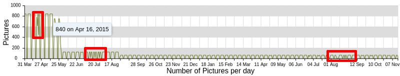

# Usage Statistics

Webcampak constantly collects metrics from the system to inform users about usage and evolution over time.

## Source Statistics

The Source Statistics provides of view of a source's usage over time.

This window is broken down in three different sections:

* __Pictures__: Number of pictures captured by day
* __Size__: Size of the pictures captured that day
* __Disk Usage__: Evolution of total source disk usage over time

## Collecting metrics

The system behaves differently depending of the type of metrics to be collected/displayed.

__Pictures__ and __Size__ are collected "on-the-fly" as requested by users, therefore can span the entire duration of a project.
__Disk Usage__ metrics are collected daily by Webcampak. In the example above, there a limited (almost none) history available since this particluar project completed in November 2017 just as this Webcampak 3 server was installed (webcampak 2 stats are not compatible with webcampak 3).

### Analyzing the stats

If we look a bit closer at what can be learnt by analyzing the stats

We can see that (using mouse-over provides more insights):

* Pictures were captured from March 31st, 2015 until November 07th, 2016. 
* From March 31st until May 03rd, 840 pictures were captured per day during business days, 0 during the weekend 
* Then the system progressively reduced pictures per day
* From May 28th until August 27th, the system was capturing 120 pictures per day
* From August 31st until November 7th, the system was capturing 60 pictures per day.

We can also see a couple of sessions with variation in the number of daily pictures, which likely indicates capture incidents. 

If we look a bit closer at one of those days, April 21st, 2015 (the first red rectangle), we can see that although the webcampak we still capturing pictures, it was apparently struggling to send them between 06:00 and 14:00.

In this particular instance there were some internet connectivity issues and it was decided that it was not worth transferring the missing pictures from webcampak local storage. On a side note, this type of issues if one of the reasons why we implemented the XFer mechanism, which will accomodate Internet connection issues.

## System Statistics

In the background, Webcampak will constantly records metrics about system usages on:

* Bandwidth
* Hard disk
* Memory (RAM)
* CPU

Users can then access those values and select a data range spanning:

* the 50 latest snapshots
* the last 50 hours with consolidated metrics (average)
* the last 50 days with consolidated metrics (average)
* the last 50 months with consolidated metrics (average)

On the above stats we can for example see that:

* There was a bandiwdth spike around February 24th, where total average bandwidth for a particular hour went up to 350KB/s. Note the selected range, which means that this spike is an average over the entire hour.
* Total disk usage is currently around 1.6 TB for this Webcampak
* Average memory usage is around 9%
* Average CPU usage is between 1% and 10%

But then we can go more granular and look at the latest captured metrics and see that:

* Outgoing bandwidth did spike at 600KB/s for shore period of time
* CPU usage did spike to 100% and 90% over the last 10 hours, but was otherwise reasonable

