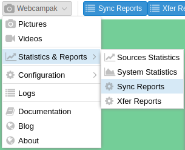
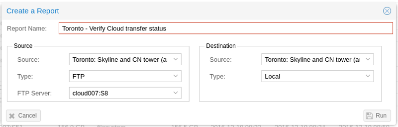
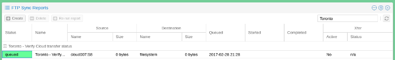
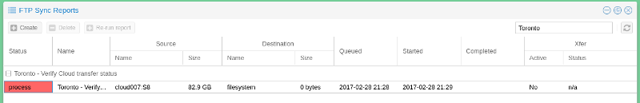
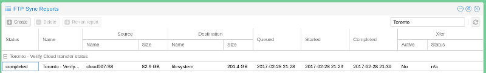
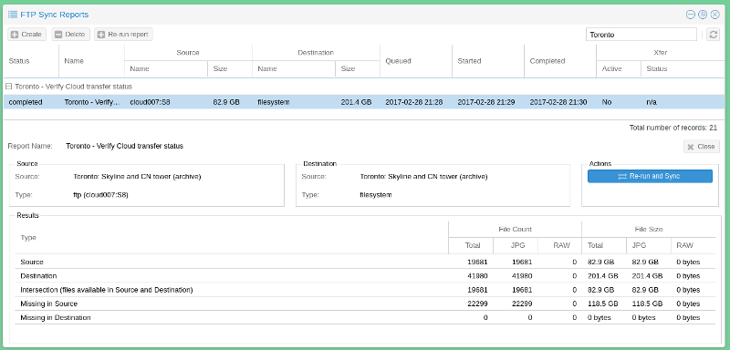
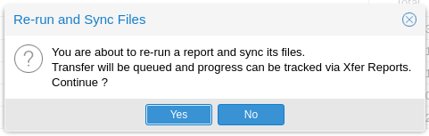
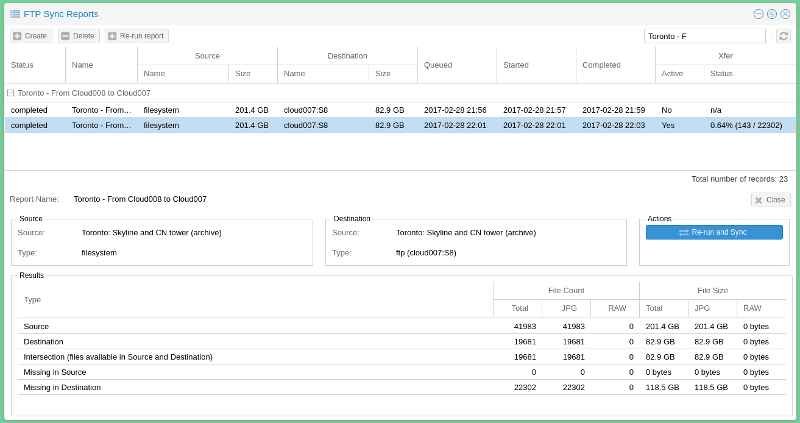
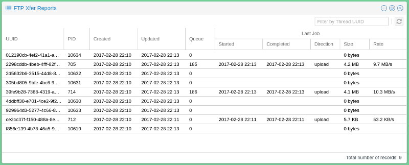

# Sync Reports

Webcampak Sync Reports is available by clicking on "Webcampak > Statistics & Reports > Sync Reports"

## Overview

With Webcampak Sync Reports features, users can compare the content of a local and a destination source, identify differences and potentially transfer any missing files.

## Pre-requisites

To use this feature, the following pre-requisites need to be met:

* Create a local source to compare against (Webcampak does not support comparing 2 remote sources)
* Register remote FTP servers in source configuration

## Create a Sync Report

A Sync Report is the comparison of files available in a source with files available in a destination.

In most situations, users compare the content of a remote source, with content stored on the local source. The "Type" field is used to specify whether there is a remote connection or not.

The sync report is then queued and executed as soon as a slot becomes available.

When completed, users can click on the report to view its details.

In this particular example, users can learn the following:

* The Source has 19,681 files, for a total of 82.9GB
* The Destination has 41,980 files, for a total of 201.4GB
* The 19,681 files in the sources are also available at the destination (no files are missing then !)
* The Destination has 22,299 files more than the source
 
With the report created, users could select it and click "Re-run report" to refresh its content when necessary.

## Sync files
 
Aside from providing a report, this features also allows users to trigger a transfer of missing files.

Since the previous report didn't have missing files in the destination, we are going to reverse it and trigger the transfer of missing files.

CAUTION: Sync actions cannot be cancelled so users must be sure to understand their system's limitations before starting to sync large amount of files

To avoid accidental sync jobs, users are required to run the report first, and from this report, trigger the sync job by clicking on "Re-run and Sync".

The system then creates XFer jobs and provides an update on progress, the far right column indicating total progress.

Resulting files are added to the XFer process in batches of 200 jobs per queue.

