# View Pictures

Captured pictures can be accessed by clicking on "Webcampak > Pictures" in the top-left menu.

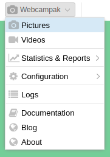

## Overview

This Pictures windows allows users to navigate through sources and their archives.

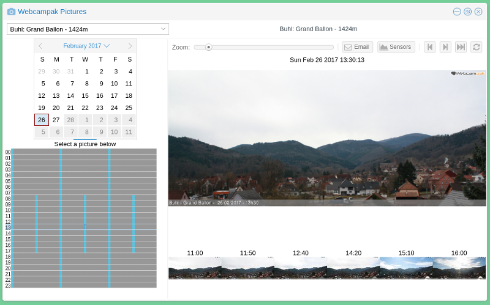

Sources can be selected using the dropdown on the top-left corner of the window, once selected, the source's title is displayed on top of the source's control panel.

When selecting a source, webcampak will automatically position the system to the latest captured picture.

Clicking on the main picture will open directly open this pictures in a new tab.

## Navigate through archives

### Select a day

Using a calendar, users can navigate through the archives, clicking on days containing pictures. The system automatically detect available days and will gray-out days with no pictures available. Current day is automatically highlighted.

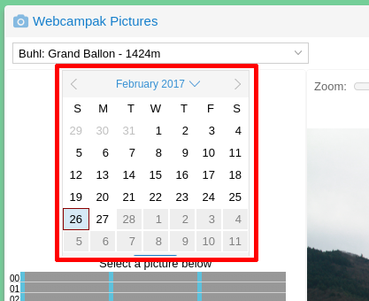

### Select a picture

All pictures captured during the day are presented in a small widget, containing one row per hour (from 00 to 23) and one column per minute (from 00 to 59).

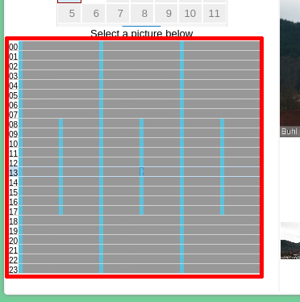

Blue cells represent timestamps with available pictures. Mousing over a specific cell will display the picture's time, clicking on the cell will open the selected picture.

On the example above you can notice that this Webcampak is configured with variable capture rate, with:

* one picture captured every 20mn between 00:00-08:00 and between 18:00-00:00
* one picture captured every 10mn between 08:00-18:00

### Navigate between pictures

Webcampak provides various means to navigate between pictures, at the top-right of the screen a series of buttons allow users to (from left to right):

* Go to the previous picture
* Go to the next pictures
* Go to the last picture captured by the source
* Refresh the list of pictures available for the source.

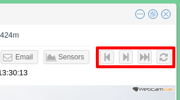

Users can also navigate by clicking on thumbnails available towards the bottom of the screen. If sufficient pictures have been captured the system will display 6 thumbnails (from left to right):

* 15th pictures captured before the currently displayed picture
* 10th pictures captured before the currently displayed picture
* 5th pictures captured before the currently displayed picture
* 5th pictures captured after the currently displayed picture
* 10th pictures captured after the currently displayed picture
* 15th pictures captured after the currently displayed picture

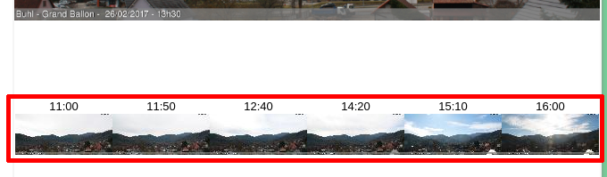

### Zoom into a picture

Users can also zoom into a picture by selecting the zoom level they would like to achieve (from 0% to 200%).

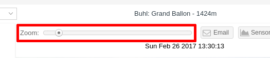

Once the zoom level is selected, moving the mouse in the window will focus on the selected area at the selected zoom level.

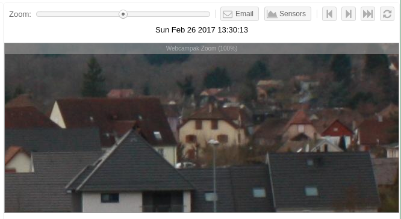

### Access Sensors

Users can also click on "Sensors" to view Phidgets sensors values captured by the system for that day.

It will open a window displaying up to 4 sensors graphs.

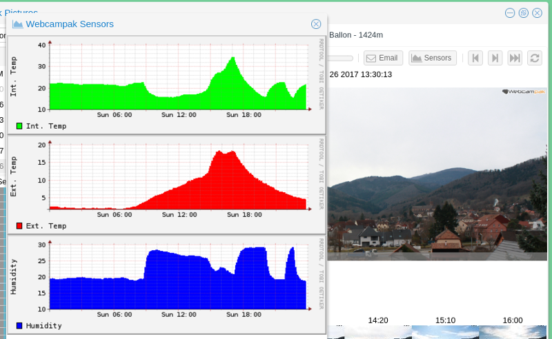

### Email a picture

Users can send the current picture by email, by clicking on "Email".

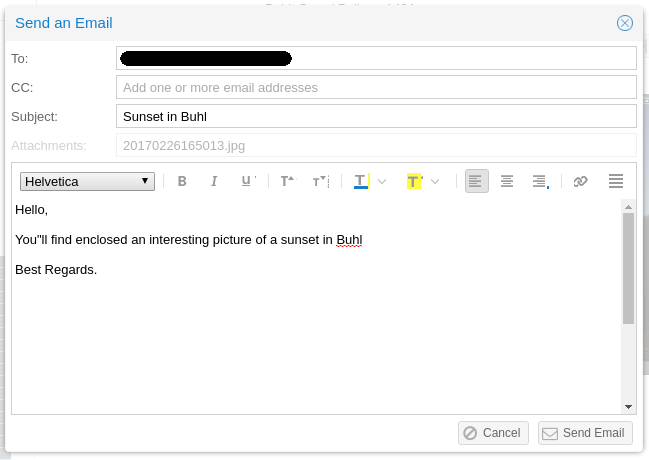

All parameters of the email can be customized, it is then placed into a queue and sent, usually, within a minute.

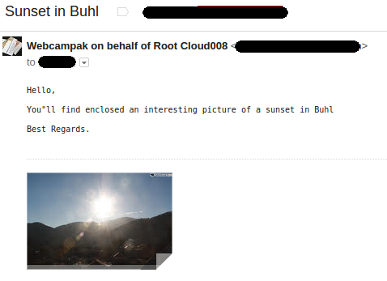

Although this email is sent by webcampak, the name of the sender is detailed in the from field to facilitates its identification and try to prevent spam.

