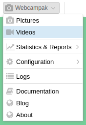
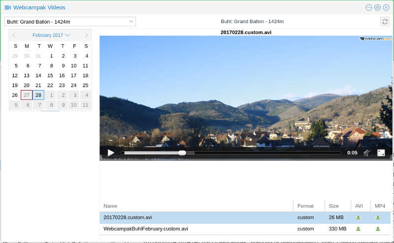
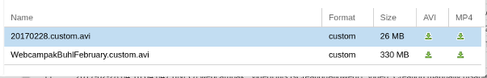

# View Videos

Generated videos can be accessed by clicking on "Webcampak > Videos" in the top-left menu.

## Overview

The Videos windows allows users to navigate through sources and their videos.

Sources can be selected using the dropdown on the top-left corner of the window, once selected, the source's title is displayed on top of the source's control panel.

When selecting a source, webcampak will automatically position the system to the latest day with videos of the selected source.

## Available videos

The bottom-right section of the window contains a list of available videos for the selected day. This list will contain a mix of automatically and user-generated videos.

Clicking on the corresponding row will open the video which can be played with the embedded player. The video can also be downloaded directly from this window.

Automatically (daily) generated video can be differentiated from user-generated videos by looking at the filename. Daily videos' filenames start with the data in YYYYMMDD format.

