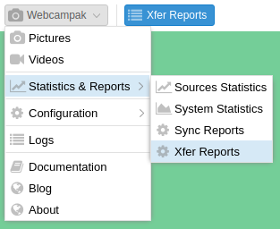
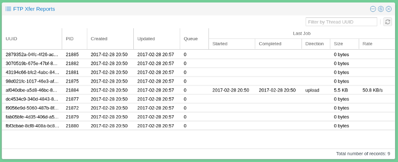

# Xfer Reports

Xfer is the file transfer mechanism available on Webcampak to deserialize picture transmission from picture processing.

## Overview

When Xfer is enabled the system will create transfer job during processing and will place those jobs in transfer queues. 

The FTP Xfer Reports window provides details about the number of transfer queues and files in those queues. It focus on jobs currently being processed on the short term. If a Sync job is being processed, this window will only provide partial details and users are encouraged to use the Sync Reports window.

The following columns are displayed:

* __UUID__: Identified of the queue
* __PID__: Webcampak process ID of the queue
* __Created__: Date & Time the queue was created
* __Updated__: Date & Time the queue was last updated
* __Queue__: Number of transfer jobs in the queue
* __Last Job__: Details about the last job processed for the queue, including its direction (upload or download, its size and and average transfer rate)

The system will regularly clear transfer queues resulting in UUID changing frequently.

